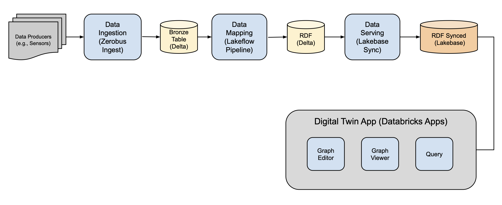

# Databricks Digital Twin Solution Accelerator


---

## Overview

This repository contains an end-to-end implementation of a **Digital Twin** for a ball bearing manufacturing process. A digital twin is a virtual representation of physical assets that synchronizes with real-world sensor data in real-time, enabling monitoring, analysis, and optimization of industrial processes.

The solution demonstrates how to build a complete digital twin system using Databricks, incorporating IoT data ingestion, semantic data modeling with RDF (Resource Description Framework), real-time synchronization, and interactive visualization via Databricks Apps.

### What This Solution Does

This accelerator shows you how to:
- **Ingest IoT sensor data** from manufacturing equipment using Databricks Zerobus Ingest
- **Transform relational data into semantic triples** using RDF/OWL ontologies
- **Map sensor readings to digital twin models** with declarative pipelines
- **Synchronize latest sensor values** to Lakebase for low-latency queries
- **Visualize the digital twin** as an interactive knowledge graph
- **Monitor production lines** with real-time dashboards

While this example focuses on manufacturing, the architecture and approach are **reusable for many other scenarios** including:
- Smart buildings and facilities
- Energy grid monitoring
- Supply chain optimization
- Healthcare equipment tracking
- Fleet management

## Architecture



The solution leverages several Databricks technologies:

1. **Databricks Zerobus** - High-throughput IoT data ingestion
2. **Delta Lake & Unity Catalog** - Unified data storage and governance
3. **Lakeflow Declarative Pipelines** - Data transformation and mapping
5. **Lakebase** - Real-time data synchronization
6. **Databricks Apps** - Interactive visualization and monitoring


## Quick Start

### Installation with Databricks Asset Bundles

The fastest way to deploy this solution is using Databricks Asset Bundles, which automates the entire setup process.

#### Prerequisites

- Databricks workspace (AWS, Azure, or GCP)
- Databricks CLI installed and configured ([installation guide](https://docs.databricks.com/en/dev-tools/cli/install))
- Unity Catalog enabled in your workspace
- SQL Warehouse for serving queries

#### Deploy the Solution

1. **Clone this repository** to your local machine:
   ```shell
   git clone https://github.com/databricks-industry-solutions/digital-twin.git
   cd digital-twin
   ```

2. **Configure your parameters** in the `0-Parameters` notebook:
   
   Open `0-Parameters.ipynb` and update all values to match your workspace environment (table locations, URLs, credentials, etc.).

   **Important:** These parameters must be configured before running the asset bundles or individual notebooks.

3. **Deploy and run the accelerator**:
   ```shell
   databricks bundle deploy
   databricks bundle run setup_solution_accelerator
   ```

The bundle will automatically:
- Create all required Delta tables
- Set up Zerobus ingestion endpoints
- Deploy the mapping pipeline
- Configure Lakebase synchronization
- Launch the visualization app

#### Cleanup

When you're finished, remove all assets created by the accelerator:

```shell
databricks bundle run teardown_solution_accelerator
databricks bundle destroy
```

## Manual Installation

If you prefer to run each step individually, follow this notebook-by-notebook approach.

> **Before you begin:** Configure the `0-Parameters` notebook with your workspace-specific settings. All other notebooks depend on these parameters.

### Notebook Overview

The setup process is divided into several notebooks that illustrate each component of the solution:

#### **0-Parameters**
**Start here!** This notebook contains all the configuration parameters required for the entire accelerator. You must customize these settings for your environment before deploying the solution.

All subsequent notebooks reference these parameters using `%run ./0-Parameters`, ensuring consistent configuration across the entire solution.


#### **1-Create-Sensor-Bronze-Table**
Define and create the Delta table where Zerobus will store incoming IoT telemetry. This notebook also includes a data generator to simulate sensor data if you don't have access to real IoT devices or Zerobus.


#### **2-Ingest-Data-Zerobus**
Set up the Zerobus endpoint and connect it to the bronze table. This notebook demonstrates how to write data to the Zerobus API (in production, this would be done by the IoT devices themselves).

#### **3-Setup-Mapping-Pipeline**
Convert incoming sensor data into timestamped RDF triples that are compatible with the digital twin ontology. Uses **Lakeflow Declarative Pipelines** with the **spark-r2r library** to perform the semantic mapping.
The result is a Delta Lake table containing RDF triples ready for querying and visualization.

#### **4-Sync-To-Lakebase**
Enhance query performance by serving the latest sensor readings from **Lakebase**. The synced table automatically maintains the most recent value from each sensor based on timestamps, providing sub-second query latency.

#### **5-Create-Serving-App**
Deploy a Databricks App that serves the triple data and displays the digital twin model as an interactive knowledge graph. The app provides:
- Real-time sensor value displays
- Interactive graph visualization of the twin model
- Filtering and navigation capabilities
- Historical trend analysis

#### **6-Cleanup**
Remove all resources created by the solution accelerator for a clean slate.


## Data Generator

The solution includes a custom `line_data_generator` library that simulates realistic sensor data from a ball bearing production line. This is useful for:
- Testing the solution without real IoT hardware
- Generating training data
- Demonstrating the system to stakeholders
- Load testing the pipeline

## Cost Considerations

The cost of running this accelerator depends on:
- Cluster/warehouse compute time
- Data storage volume in Delta Lake
- Lakebase instance size and uptime
- App serving hours

It is the user's responsibility to monitor and manage associated costs. Consider starting with smaller configurations and scaling as needed.

## Contributing

We welcome contributions! Please see [CONTRIBUTING.md](CONTRIBUTING.md) for guidelines.

## Security

For security concerns, please review [SECURITY.md](SECURITY.md).

## License

© 2025 Databricks, Inc. All rights reserved. 

The source in this notebook is provided subject to the [Databricks License](https://databricks.com/db-license-source). All included or referenced third-party libraries are subject to their respective licenses.

## Support

For questions or issues:
1. Check the [Databricks documentation](https://docs.databricks.com)
2. Open an issue in this repository
3. Contact Databricks support if you're a customer

---

**Ready to build your digital twin?** Start by cloning this repo and running the Quick Start guide above!
